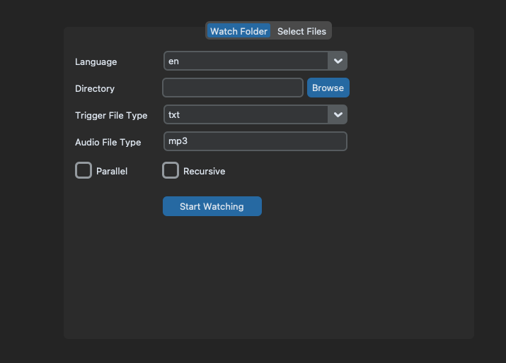
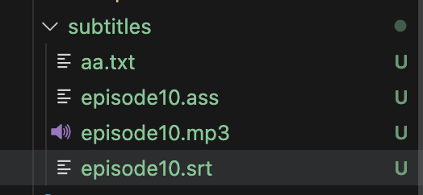

# 🎙️ Fast Whisper AI Subtitle Generator

Generate subtitles from audio files using [Fast Whisper AI](https://github.com/SYSTRAN/faster-whisper).

ATTENTION: Just like any other speech-to-text LLM, it may produce transcription errors.

## How does it work?

The program watches a directory selected by the user. You specify:
- The **file type** you want to convert into subtitles (e.g., `.mp3`)
- A **trigger file type** (e.g., `.txt`)

Place all the `.mp3` files you want to convert into the watched directory. When you're ready, create the trigger `.txt` file in that directory. This signals the program to start converting all matching files into `.srt` and `.ass` subtitle files.

Then, you can apply those subtitles to your videos:


- `.srt` files are simpler and supported by most video players.
- `.ass` files are more polished and can include advanced styling (as shown above).

---
## Requirements

If you want to do it without using Makefile you would need the following to run the project:

- Python
- Poetry

Go to the project's root and run the following command:

```bash
poetry install
```

After this you should be able to execute:

```bash
poetry run python src/subtitles_generator/gui.py
```

---

## Makefile commands

### For Windows
```bash
make windows_full_installation
```

### For macOS
```bash
make mac_full_installation
```

To run without reinstalling:
```bash
make run
```

---

## Python command

If you don't want to use the GUI you may use:

```bash
poetry run python src/subtitles_generator/main.py <language> <directory> <trigger_filet> <audio_format> <parallel> <recursive>
```


---

## GUI

The program uses **CustomTkinter** for the graphical interface.  
You should see a layout similar to this:



### Watch Folder parameters

| Parameter       | Description |
|-----------------|-------------|
| **language**    | The language you want Whisper to interpret |
| **directory**   | The directory the program will watch |
| **file_type**   | The file type you want to generate subtitles from (e.g., `mp3`). FFmpeg is capable of consuming almost any kind of audio/video file |
| **file_trigger**| When detected, the program starts searching for files with the `file_type` you specified |
| **parallel**    | If enabled, processes all detected files simultaneously (performance depends on your computer) |
| **recursive**   | If enabled, it will also watch for sub-directories traversed recursively |

### Select Files parameters

| Parameter            | Description |
|----------------------|-------------|
| **language**         | The language you want Whisper to interpret |
| **audio files**      | The audio/video files you want to generate subtitles from (e.g., `.mp3`, `.wav`, `.mp4`) |
| **output directory** | The directory where the generated subtitle files will be saved. Defaults to the same directory as the selected files |
| **parallel**         | If enabled, processes all selected files simultaneously (performance depends on your computer) |

---

## Process

1. Run `make run`

2. You can select between Watch Folder / Select Files
   
   

2.1. (Watch Folder) Select the file you want the program to watch (e.g., `.txt`).

2.1.1. It will start watching the folder, and if you look at the console. You will see the message: 'Waiting for a (file_type) to be created on: "Selected_Directory". Put all the files you want it to Transcribe and just create the trigger file you want.

2.1.2. Once the trigger file is detected, processing begins. The process may take some time all depends on how many files and their size.

2.2.1 (Select Files) Select the Files you want to Transcribe and the ouput where the subtitles will be generated.

3. When finished, `.srt` and `.ass` files are generated.

   
