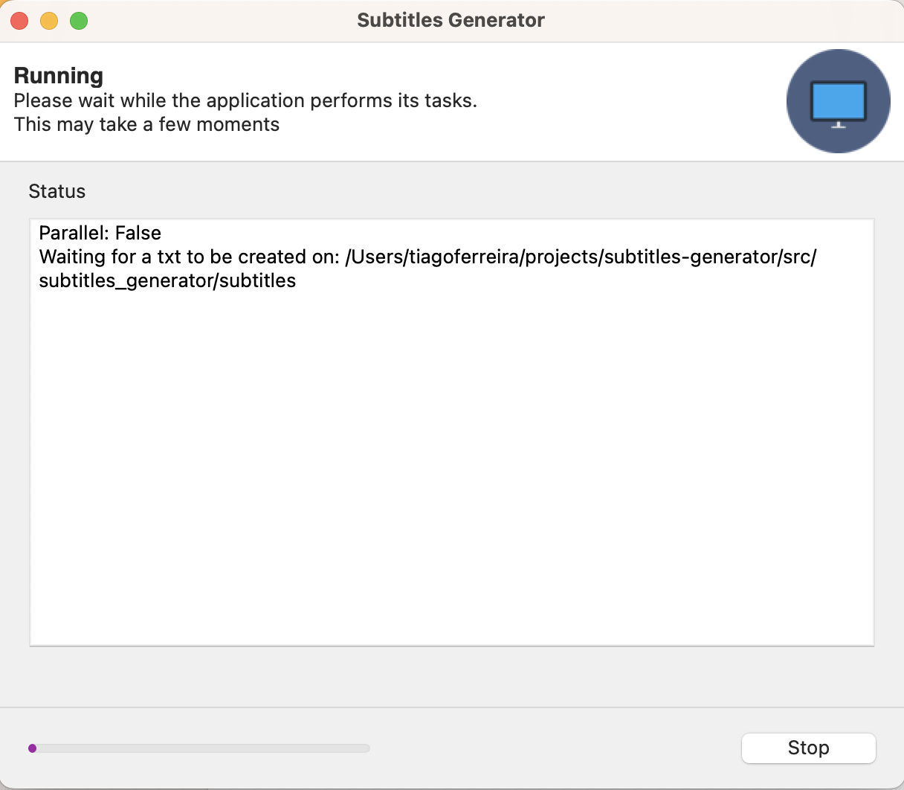

# 🎙️ Whisper AI Subtitle Generator

Generate subtitles from speech using [Whisper AI](https://github.com/openai/whisper).

## How does it work?

The program watches a directory selected by the user. You specify:
- The **file type** you want to convert into subtitles (e.g., `.mp3`)
- A **trigger file type** (e.g., `.txt`)

Place all the `.mp3` files you want to convert into the watched directory. When you're ready, create the trigger `.txt` file in that directory. This signals the program to start converting all matching files into `.srt` and `.ass` subtitle files.

Then, you can apply those subtitles to your videos:


- `.srt` files are simpler and supported by most video players.
- `.ass` files are more polished and can include advanced styling (as shown above).

---

## Makefile commands

### For Windows
```bash
make windows_full_installation
```

### For macOS
```bash
make mac_full_installation
```

To run without reinstalling:
```bash
make run
```

---

## GUI

The program uses **Gooey** for the graphical interface.  
You should see a layout similar to this:


### Parameter descriptions

| Parameter       | Description |
|-----------------|-------------|
| **language**    | The language you want Whisper to interpret |
| **directory**   | The directory the program will watch |
| **file_type**   | The file type you want to generate subtitles from (e.g., `.mp3`) |
| **file_trigger**| When detected, the program starts searching for files with the `file_type` you specified |
| **parallel**    | If enabled, processes all detected files simultaneously (performance depends on your computer) |

---

## Process

1. Set the parameters and select the directory.

2. The program waits until it detects the trigger file you specified.  
   
   

3. Place your files in the directory, then create or move the trigger file there (e.g., `.txt`).

   

4. Once the trigger file is detected, processing begins.

   

5. When finished, `.srt` and `.ass` files are generated.

   
